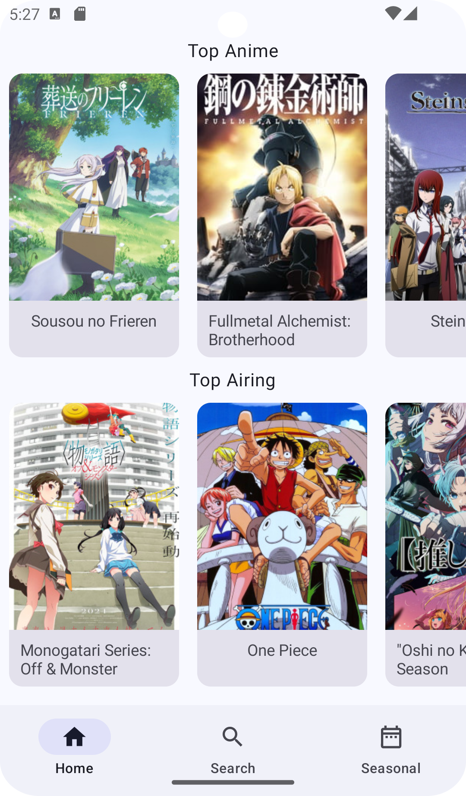
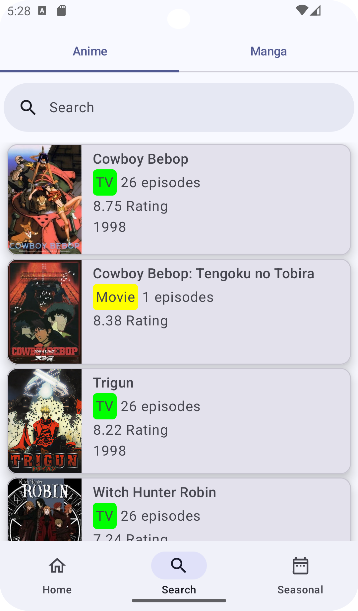
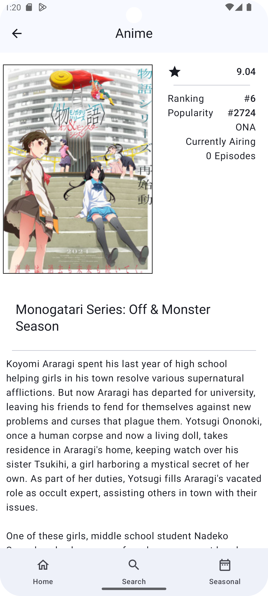
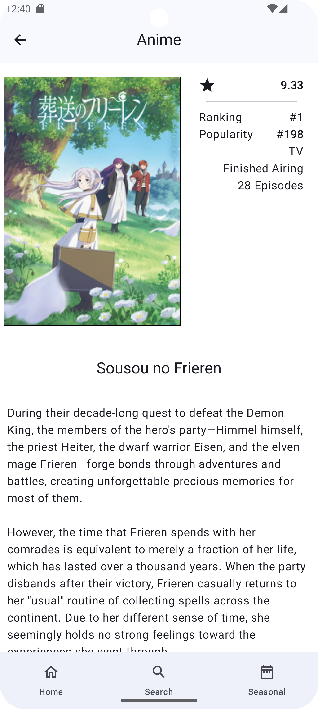

# Anime/Manga Only List
Using Jetpack Compose, Retrofit, Coil, GSON Converter, okHTTp, Kotlin Coroutines, Jikan API

  
  
  
  

### Current Features
 * Search for Anime using the Jikan Api

### WiP
 * Revamped Theming
 * Manga implementation
 * Sort by different order
 * Dark Mode
 * Seasonal Anime - current, past and upcoming
 * Better loading screen
 * Random recommendations
 * People/Producer/Staff
 * Anime release schedule
 * & More
